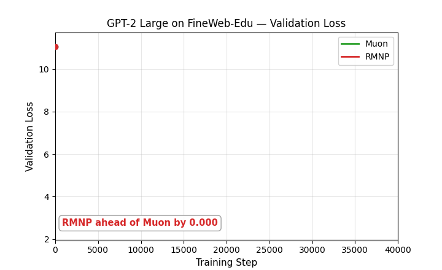
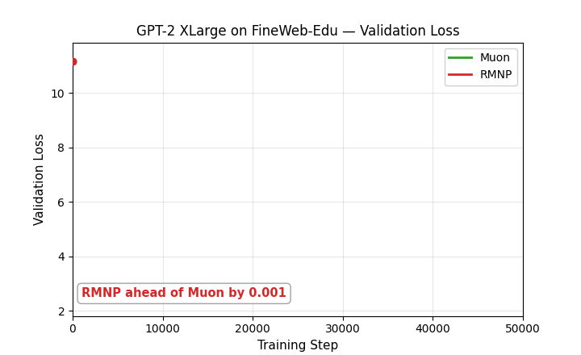

# Muon vs. RMNP: Validation-Loss Races

Animated validation-loss curves for **Muon vs. RMNP only** (AdamW omitted for clarity), one per model/dataset. Each GIF reveals the curve step by step, tags whichever optimizer currently has the lower loss, and marks the first step where RMNP overtakes Muon for good with a dashed line. See the main [**`README.md`**](README.md#validation-loss-race-rmnp-catches-up-to-muon) for the highlighted GPT-2 Small and LLaMA-135M races. The two additional GPT-2 sizes are below.

## GPT-2 Small — FineWeb-Edu, 10K steps

RMNP trails Muon by up to ~0.02 through step 4K, catches up at step 5K, and finishes 0.005 lower.

## GPT-2 Large — FineWeb-Edu, 40K steps

RMNP is roughly tied with Muon for most of training, dips briefly behind around step 20K, then pulls ahead for good at step 21K and finishes 0.029 lower.

## GPT-2 XLarge — FineWeb-Edu, 50K steps

RMNP and Muon trade the lead repeatedly at this scale, but RMNP is ahead more often than not and finishes 0.030 lower.

## LLaMA-135M — C4, 20K steps

RMNP trails Muon for most of training, catches up at step 14.5K, and finishes 0.016 lower.

---

Generated from `Step, *-muon-*, *-rnnps-*`/`*-rmnp-*` columns in the corresponding CSVs (RMNP was named RNNPS at data-collection time). Regenerate with `make_loss_gifs.py` in the `Visualize/Loss-Curve/` data repo.
