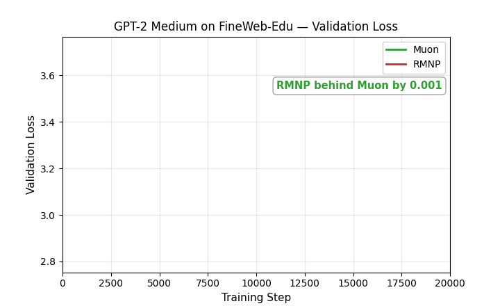
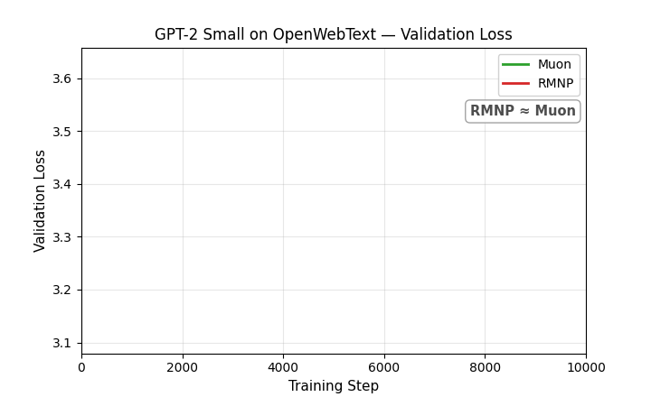
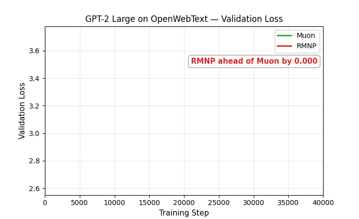
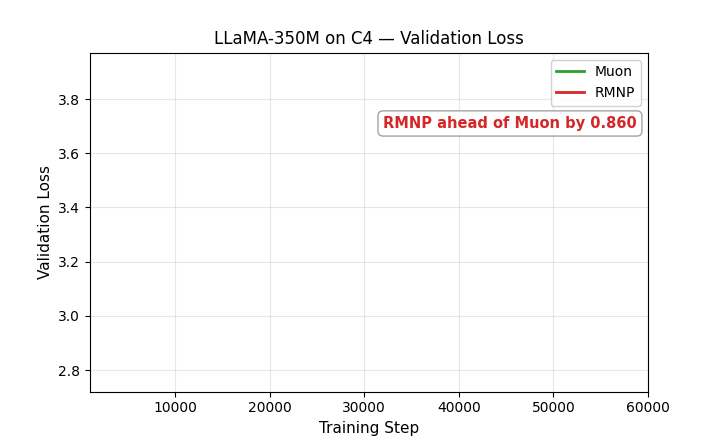

# Muon vs. RMNP: Validation-Loss Races

Animated validation-loss curves for **Muon vs. RMNP only**, with AdamW omitted for clarity, covering every GPT-2 size on both OpenWebText and FineWeb-Edu, and every LLaMA size from 60M to 1B on C4 — 11 races in total. Each GIF reveals the curve step by step, tags whichever optimizer currently has the lower loss, and marks the first step where RMNP overtakes Muon for good with a dashed line.

How long RMNP trails before catching up varies a lot across these 11 runs, from as little as 5% of training (GPT-2 Large on FineWeb-Edu) to as much as 90% (LLaMA-350M on C4, though its final gap is a near-exact tie). See the main [**`README.md`**](README.md#validation-loss-race-rmnp-catches-up-to-muon) for two representative examples, GPT-2 Small on FineWeb-Edu and LLaMA-135M on C4. The rest are organized by dataset below.

## GPT-2 on FineWeb-Edu-100B

### Small — 10K steps

RMNP trails Muon by up to ~0.02 through step 4K, catches up at step 5K, and finishes 0.005 lower.

### Medium — 20K steps

RMNP and Muon stay close for most of training, trading the lead several times, and RMNP finishes 0.004 lower.

### Large — 40K steps

RMNP is roughly tied with Muon for most of training, dips briefly behind around step 20K, then pulls ahead for good at step 21K and finishes 0.029 lower.

### XLarge — 50K steps

RMNP and Muon trade the lead repeatedly at this scale, but RMNP is ahead more often than not and finishes 0.030 lower.

## GPT-2 on OpenWebText

### Small — 10K steps

RMNP trails Muon for 80% of training, the longest early-trailing stretch among the GPT-2 runs, catches up only at step 9K, and finishes just 0.002 lower.

### Medium — 20K steps

RMNP jumps ahead early, dips behind around step 2K, catches up again at step 5K, and finishes 0.019 lower, the largest margin of the three OpenWebText sizes.

### Large — 40K steps

RMNP and Muon trade the lead repeatedly throughout training, mirroring the FineWeb-Edu race at this size, and RMNP finishes 0.029 lower.

## LLaMA on C4

### 60M — 10K steps

RMNP leads early, Muon takes over from roughly step 1.1K to step 6K, and RMNP edges back ahead at step 6K to finish 0.016 lower.

### 135M — 20K steps

RMNP trails Muon for most of training, catches up at step 14.5K, and finishes 0.016 lower.

### 350M — 60K steps

RMNP leads briefly at the very start, then Muon takes over for nearly the entire run, from step 5K through step 54K. RMNP narrowly reclaims the lead right at the end, finishing in a near-exact tie, just 0.0002 lower.

### 1B — 90K steps

RMNP leads early, Muon takes over from step 6K to step 14K, and RMNP reclaims the lead at step 14K to finish 0.017 lower, the largest model in the C4 sweep.

