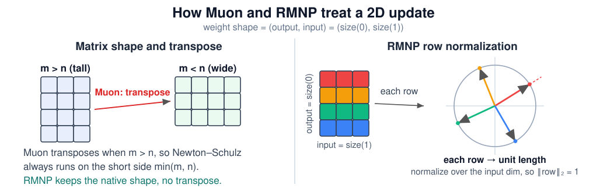
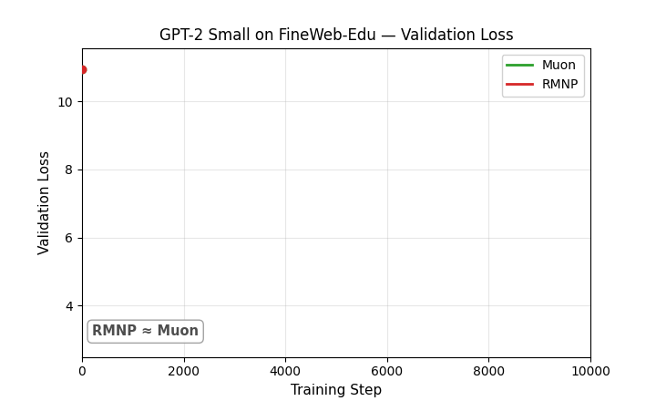
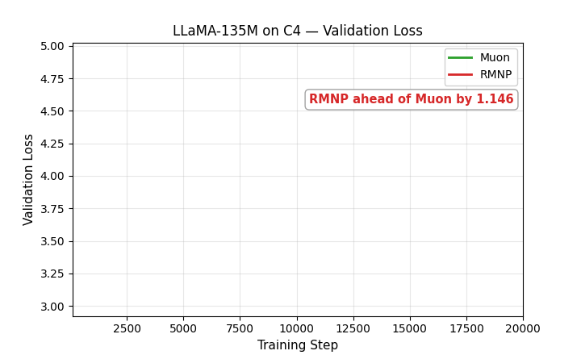
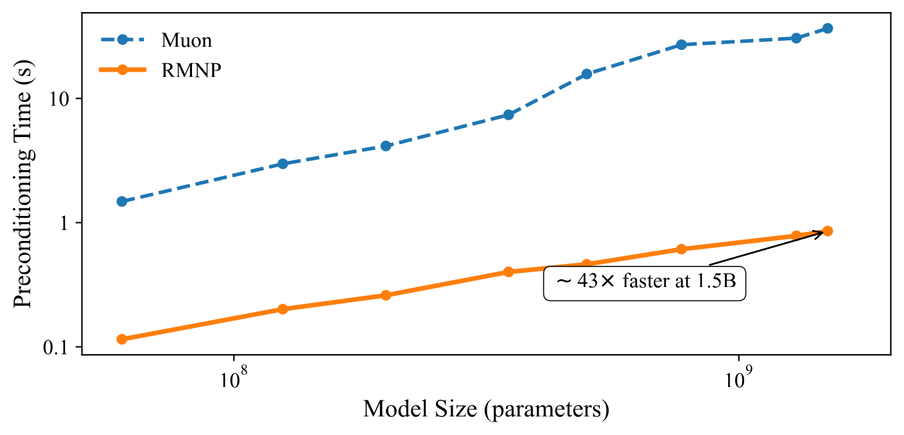

# RMNP: Row-Momentum Normalized Preconditioning for Scalable Matrix-Based Optimization

> ### $\color{blue}{\textbf{A simple input-dimension normalization goes a long way toward orthogonalization.}}$

This repository contains the official implementation of **RMNP (Row-Momentum Normalized Preconditioning)**, a scalable matrix-based optimizer for large model pre-training. RMNP replaces the Newton–Schulz (NS) iteration used by **Muon** with $\color{blue}{\textbf{a simple per-row } \ell_2 \textbf{ normalization}}$ of the momentum buffer, which is provably equivalent to Muon's orthogonalization step under the row-wise block-diagonal dominance regime that we observe to hold (and grow stronger) for transformer gradient momentum matrices in practice.

## News

- **[ICML 2026]** RMNP is presented at the [Protocol Learning Workshop](https://luma.com/almfr7q2?tk=hon6B4) in Seoul, South Korea.
- **[ICML 2026 HiLD Workshop]** The theoretical paper, [*"How Does Orthogonalization Adapt to the Neural-Network Hessian Structure? A Gradient Self Outer-Product Analysis at Initialization"*](https://openreview.net/pdf?id=U812abpXRD), has been accepted at the Workshop on High-dimensional Learning Dynamics.
- **[ICML 2026]** RMNP has been accepted to the 43rd International Conference on Machine Learning.

## Algorithms

### Muon

```math
\begin{aligned}
        &\textbf{Input:} \ \eta,\ \mu,\ K \ \text{(NS steps)} \\
        &\textbf{Initialize:}\ \theta_0,\ m_0 \leftarrow 0 \\
        &\textbf{for } t=1 \text{ to } T \text{ do} \\
        &\quad g_t \leftarrow \nabla f(\theta_{t-1}) \\
        &\quad m_t \leftarrow \mu\, m_{t-1} + g_t \\
        &\quad \color{red}{O_t \leftarrow \text{NewtonSchulz}(m_t,\ K)} \\
        &\quad \theta_t \leftarrow \theta_{t-1} - \eta\, O_t \\
        &\textbf{end for}
    \end{aligned}
```

### RMNP (Ours)

```math
\begin{aligned}
        &\textbf{Input:} \ \eta,\ \mu,\ \epsilon \\
        &\textbf{Initialize:}\ W_0,\ M_0 \leftarrow 0 \\
        &\textbf{for } t=1 \text{ to } T \text{ do} \\
        &\quad G_t \leftarrow \nabla_W f_t(W_{t-1}) \\
        &\quad M_t \leftarrow \mu\, M_{t-1} + (1-\mu)\, G_t \\
        &\quad \color{blue}{R_t \leftarrow \mathrm{RowNormalize}(M_t;\ \epsilon)} \\
        &\quad W_t \leftarrow W_{t-1} - \eta\, R_t \\
        &\textbf{end for}
    \end{aligned}
```

with
```math
\bigl[\mathrm{RowNormalize}(M;\epsilon)\bigr]_{i,:} \;=\; \frac{M_{i,:}}{\lVert M_{i,:} \rVert_2 + \epsilon}.
```

### Implementation Details

<p align="center">
  n, 4x3) Muon transposes to the short side while RMNP does not, and for a wide matrix (m<n, 3x4) neither needs a transpose. Right: each row is one output neuron, and RMNP normalizes it over the input dim, mapping every row onto the unit sphere so its L2 norm is 1." width="100%">
</p>

Muon and RMNP share the same optimizer skeleton and differ in a single operation on each 2D update. The diff below shows exactly what changes. The red lines run only in Muon, and the green line is what RMNP uses instead.

```diff
  # update for a 2D momentum matrix M of shape (m, n)
- if M.size(0) > M.size(1):     # Muon transposes tall matrices (m > n)
-     M = M.T                   # so Newton-Schulz runs on the smaller min(m, n)
- for _ in range(steps):        # Newton-Schulz orthogonalization
-     A = M @ M.T
-     B = A @ M
-     M = a*M + b*B + c*A@B
- if M.size(0) > M.size(1):
-     M = M.T                   # transpose back
+ M = F.normalize(M, p=2, dim=-1)   # RMNP: one row normalization, no transpose
```

The highlighted lines carry the whole story. Muon transposes any tall matrix so that Newton-Schulz always runs on the smaller dimension $\min(m, n)$, and it transposes the result back. RMNP drops all of that and applies a single row normalization in the native (output, input) layout, so it normalizes the row dimension whether the matrix is tall or wide. This is why RMNP does not fully approximate Muon. We keep the no-transpose version on purpose, because we found that it trains better than the transpose-aligned version that would mirror Muon exactly.

**Learning rates.** RMNP keeps the same two learning rates as Muon. One is the AdamW learning rate for the 1D parameters, the embedding, and the lm_head. The other is the matrix learning rate for the 2D weights, and we set it slightly larger than the AdamW one. See [GPT-2/README.md](GPT-2/README.md) and [LLaMA/README.md](LLaMA/README.md) for the exact values.

### Diagonal-Dominance Monitoring

To verify the condition under which $\mathrm{RowNormalize}(M_t) \approx U V^\top$ holds, we monitor the row-wise diagonal-dominance ratio of the Gram matrix $V_t V_t^\top$ throughout training. For row $i$ we define

```math
r_i \;=\; \frac{\bigl|(V_t V_t^\top)_{ii}\bigr|}{\tfrac{1}{m-1}\sum_{j\neq i}\bigl|(V_t V_t^\top)_{ij}\bigr|},
```

and aggregate across rows to obtain $r_{\text{avg}}$, $r_{\min}$, $r_{\max}$. Averaging these three statistics over all matrix parameters in the network gives the global metrics $\overline{r_{\text{avg}}}$, $\overline{r_{\min}}$, $\overline{r_{\max}}$. A value $r_i > 1$ means the diagonal entry exceeds the mean off-diagonal magnitude in row $i$. The larger this value is, the closer $V_t V_t^\top$ is to a diagonal matrix.


**Observations.** Across all six configurations and the full training trajectory: $\overline{r_{\min}}$ stays comfortably above the $y=1$ threshold, $\overline{r_{\text{avg}}}$ consistently exceeds $5$, and $\overline{r_{\max}}$ reaches the order of tens. More importantly, **diagonal dominance strengthens monotonically as model size grows**. GPT-2 Large and LLaMA 350M exhibit visibly higher $\overline{r}$ across all three statistics than their smaller counterparts. This indicates that the row-wise block-diagonal dominance underlying RMNP is not an artefact of small scale. Instead, it becomes *more* pronounced as models scale, which makes RMNP an increasingly favorable replacement for Muon's NS iteration at scale.

**Key idea.** When $M_t$ is row-diagonally dominant (empirically observed and strengthening with scale), the leading singular directions of $M_t$ align with its rows, and the orthogonal factor from $M_t = U\Sigma V^\top$ satisfies $U V^\top \approx \mathrm{RowNormalize}(M_t)$. RMNP therefore matches Muon's update direction while replacing the iterative NS polynomial (multiple matmuls per step) with a single elementwise normalization. This yields lower wall-clock cost and friendlier scaling to large hidden dimensions.

## Main Results

### Perplexity


RMNP matches or exceeds Muon's perplexity across **every** model scale and dataset, consistent with the diagonal-dominance trend reported above.

### Validation-Loss Race: RMNP Catches Up to Muon

RMNP's single row normalization is a much cruder preconditioner than Muon's iterative Newton–Schulz orthogonalization, so early in training RMNP *can* trail Muon, though this is not guaranteed and its extent varies widely by run and model size. The two animations below are representative examples of that early-trailing pattern. Each replays validation loss step by step for **Muon vs. RMNP only**, with AdamW omitted for clarity. A dashed marker flags the first step where RMNP overtakes Muon and stays there.

<p align="center">
  
  
</p>

Nine more races are animated in [**`LOSS_CURVES.md`**](LOSS_CURVES.md), covering every GPT-2 size on both OpenWebText and FineWeb-Edu, and every LLaMA size from 60M to 1B on C4. How long RMNP trails before catching up varies widely across them, from as little as 5% of training to as much as 90%.

### Preconditioner Wall-Clock Time

<p align="center">
  
</p>

RMNP's row normalization is **13×–44× faster** than Muon's Newton–Schulz orthogonalization on GPT-2 models from 60M to 1.5B (measured over 100 steps with batch size 16 on a single RTX Pro 6000 GPU), and the gap widens with model size: as Newton–Schulz becomes the dominant bottleneck at scale, RMNP's lightweight preconditioner becomes increasingly attractive for very large models.

## Repository Layout

```
RMNP/
├── GPT-2/        # GPT-2 (125M / 355M / 770M / XL) pre-training pipeline
│   ├── RMNP/             # model & training entrypoints (train_{adamw,muon,rmnp}.py)
│   ├── config/           # per-(size, optimizer) training configs
│   ├── scripts/          # ready-to-run shell launchers
│   └── data/             # OpenWebText preparation (nanoGPT-style)
└── LLaMA/        # LLaMA (60M / 135M / 350M / 1B) pre-training pipeline
    ├── optimizers/       # RMNP_optimizer.py, muon_optimizer.py
    ├── configs/          # llama_{60m,135m,350m,1b}.json model configs
    ├── scripts/          # per-(size, optimizer) launchers
    └── torchrun_main.py  # distributed training entrypoint
```

Both sub-projects ship the same three optimizer baselines, **AdamW**, **Muon**, and **RMNP**, so that results can be reproduced under matched data, schedule, and hyperparameters.

## Installation

We recommend Python **3.12** with CUDA-capable GPUs. Create a fresh environment and install the pinned dependencies:

```bash
git clone https://github.com/Dominator-Index/RMNP.git
cd RMNP

conda create -n rmnp python=3.12 -y
conda activate rmnp

pip install -r requirements.txt
```

> `flash-attn` requires a working CUDA toolchain and may take several minutes to build; if it fails, install it separately with `pip install flash-attn --no-build-isolation` after `torch` is in place. The setup is fully compatible with the upstream [MARS](https://github.com/AGI-Arena/MARS) repository, so its install instructions also work.

## Quick Start

Each sub-project is self-contained. Its local README covers data preparation, the full list of launch scripts, and the exact command for every run, with the hyperparameters written out for each optimizer, dataset, and model size. A typical command looks like `LR=2e-3 bash scripts/run_rmnp_small_streaming_fw.sh`.

- [**`GPT-2/README.md`**](GPT-2/README.md) covers GPT-2 pre-training. It is organized by dataset, then optimizer, then size. **OpenWebText** (`_owt`) covers Small, Medium, and Large, while **FineWeb-Edu-100B** (`_fw`) covers Small, Medium, Large, and XL. Each dataset runs with AdamW, Muon, and RMNP. The [**Running Training Scripts**](GPT-2/README.md#running-training-scripts) section has copy-paste commands.
- [**`LLaMA/README.md`**](LLaMA/README.md) covers LLaMA pre-training on streaming **C4**. It is organized by optimizer, then size. The optimizers are AdamW, Muon, Muon-All, RMNP, and RMNP-All, and each one runs at 60M, 135M, 350M, and 1B. The [**Running Training Scripts**](LLaMA/README.md#running-training-scripts) section has copy-paste commands.

Once the environment is ready, launch a run with:

```bash
# GPT-2 Small with RMNP
cd GPT-2
export HF_TOKEN=...        # for streaming datasets
export WANDB_API_KEY=...
bash scripts/run_rmnp_small.sh

# LLaMA 60M with RMNP
cd LLaMA
bash scripts/train_RMNP_60m.sh
```

## Using the RMNP Optimizer in Your Own Code

A standalone optimizer package lives at [`rmnp/`](rmnp/). Install via PyPI:

```bash
pip install rmnp
```

Use it like any `torch.optim.Optimizer`. Following Muon's convention, route all 2D weight matrices through `RMNP` and 1D/0D parameters (biases, LayerNorm scales) through AdamW:

```python
import torch
from rmnp import RMNP

matrix_params = [p for p in model.parameters() if p.ndim >= 2]
other_params  = [p for p in model.parameters() if p.ndim <  2]

rmnp_opt  = RMNP(matrix_params, lr=2e-2, momentum=0.95, weight_decay=0.0)
adamw_opt = torch.optim.AdamW(other_params, lr=3e-4, weight_decay=0.1)

# In the training loop: call .step() on both, .zero_grad() on both.
```

Distributed training works out of the box: when `WORLD_SIZE > 1`, updates are sharded across ranks and synchronized via `all_reduce`.
## Citation

If you find this work useful, please cite:

```bibtex
@inproceedings{dengrmnp,
  title={RMNP: Row-Momentum Normalized Preconditioning for Scalable Matrix-Based Optimization},
  author={Deng, Shenyang and Ouyang, Zhuoli and Pang, Tianyu and Liu, Zihang and Jin, Ruochen and Yu, Shuhua and Yang, Yaoqing},
  booktitle={Forty-third International Conference on Machine Learning}
}
```

## Acknowledgements

This repository is built upon [MARS](https://github.com/AGI-Arena/MARS) and [GaLore](https://github.com/jiaweizzhao/GaLore). We thank the authors for open-sourcing their codebases.

## Contact

Questions and feedback are welcome. Feel free to reach out to shenyang.deng.gr@dartmouth.edu, oyzl2004@gmail.com, or Zhuoli.Ouyang@dartmouth.edu.

